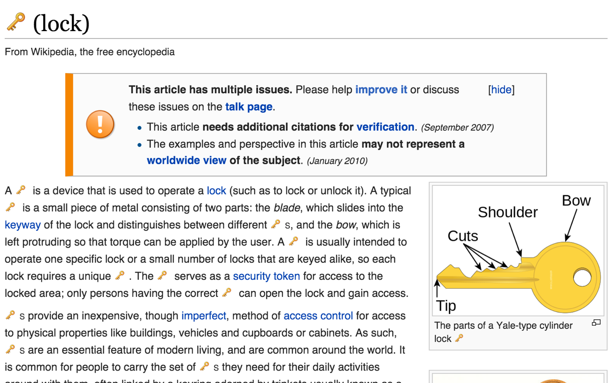

# dj-khaledify
Chrome extension that replaces all instances of "key" to the key emoji.

[Download it here!](https://chrome.google.com/webstore/detail/dj-khaledify/kadkjmconegfdacmcblecejmldnokpbh)

And super huge thanks to the [Cloud-to-Butt extension](https://chrome.google.com/webstore/detail/cloud-to-butt-plus/apmlngnhgbnjpajelfkmabhkfapgnoai?hl=en), whose code showed me the way.
